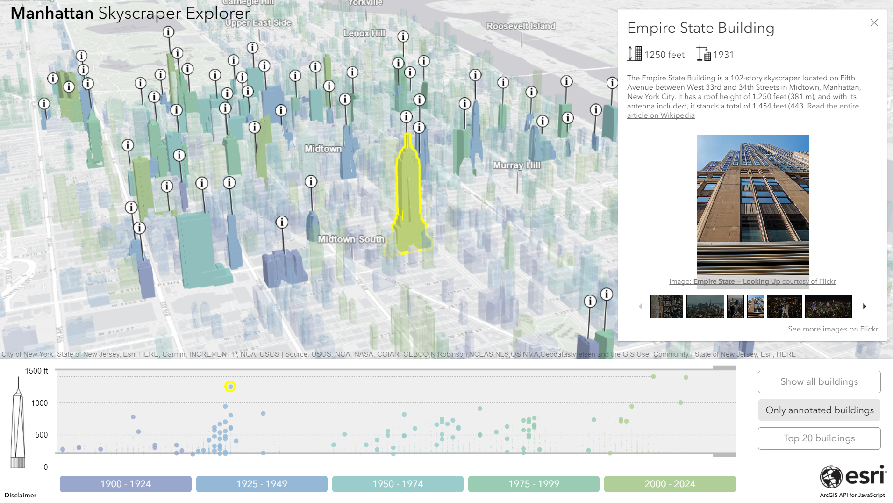

# Manhattan Skyscraper Explorer

This is a non-commercial, demo application made at the Esri R&D Center Zurich for building exploration in Manhattan. It is built on top of [ArcGIS API for JavaScript](https://developers.arcgis.com/javascript/) and allows users to explore some of the highest buildings in Manhattan in 3D.

[View it live](https://esri.github.io/Manhattan-skyscraper-explorer/)

## Features

* Data driven visualization of buildings in Manhattan
* Highlighting of selected buildings
* Display information from different sources for selected building.
* Different visualization options for point features: callout lines, relative to scene elevation mode, decluttering.

## Instructions

1. Fork and then clone the repo.
2. Run and try the samples.

## Requirements

* Notepad or your favorite HTML editor
* Web browser with access to the Internet

## Resources
The following external libraries, APIs and open datasets were used in the making of this application:

* <a href="https://d3js.org/" target="_blank">D3js</a> for the timeline. D3js is shared under a <a href="https://github.com/d3/d3/blob/master/LICENSE" target="blank">BSD 3 clause license</a>.
* <a href="https://www.mediawiki.org/wiki/API:Main_page" target="_blank">Wikipedia API / MediaWiki</a> is used to retrieve a small description of the building. All retrieved pages are under the <a href="https://en.wikipedia.org/wiki/Wikipedia:Text_of_Creative_Commons_Attribution-ShareAlike_3.0_Unported_License" target="_blank">Creative Commons Attribution-ShareAlike License</a>. See <a href="https://wikimediafoundation.org/wiki/Terms_of_Use" target="_blank">Wikipedia Terms of Use</a> for details.
* This application uses the <a href="https://www.flickr.com/services/api/" target="_blank">Flickr API</a> but is not endorsed or certified by <a href="https://www.flickr.com/" target="_blank">Flickr</a>. Flickr API is used to retrieve building images under <a href="https://creativecommons.org/licenses/" target="_blank">Creative Commons licenses</a>. See <a href="https://www.flickr.com/services/api/tos/" target="_blank">Flickr Terms of Use</a> for licensing information.
* <a href="https://galleria.io/downloads/classic/" target="_blank">Galleria classic theme</a> and <a href="https://jquery.com/" target="_blank">JQuery</a> for the image gallery. Both libraries are under <a href="https://opensource.org/licenses/MIT" target="_blank">MIT license</a>.
* <a href="http://www1.nyc.gov/site/doitt/initiatives/3d-building.page" target="_blank">3D building model</a> published on the Open Data portal of <a href="http://www1.nyc.gov/site/doitt/index.page" target="_blank">DoITT</a> under these <a href="http://www1.nyc.gov/home/terms-of-use.page" target="_blank">Terms of use</a>.
* <a href="http://catalog.opendata.city/dataset/pediacities-nyc-neighborhoods/resource/91778048-3c58-449c-a3f9-365ed203e914" target="_blank"> Manhattan neighborhoods </a> provided by <a href="http://catalog.opendata.city/" target="_blank">Catalog Opendata City</a> under a <a href="http://opendefinition.org/licenses/odc-by/" target="_blank">Open Data Commons Attribution License</a>.

## Disclaimer

This demo application is for illustrative purposes only and it is not maintained. There is no support available for deployment or development of the application.

## Contributing

Esri welcomes contributions from anyone and everyone. Please see our [guidelines for contributing](https://github.com/esri/contributing).

## Licensing
Copyright 2017 Esri

Licensed under the Apache License, Version 2.0 (the "License");
you may not use this file except in compliance with the License.
You may obtain a copy of the License at

   http://www.apache.org/licenses/LICENSE-2.0

Unless required by applicable law or agreed to in writing, software
distributed under the License is distributed on an "AS IS" BASIS,
WITHOUT WARRANTIES OR CONDITIONS OF ANY KIND, either express or implied.
See the License for the specific language governing permissions and
limitations under the License.

A copy of the license is available in the repository's [license.txt](./license.txt ) file.
